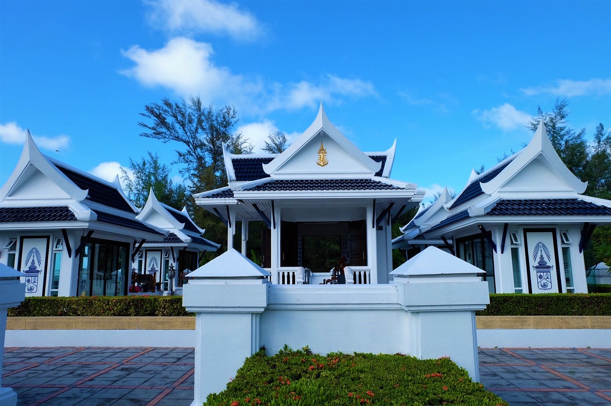
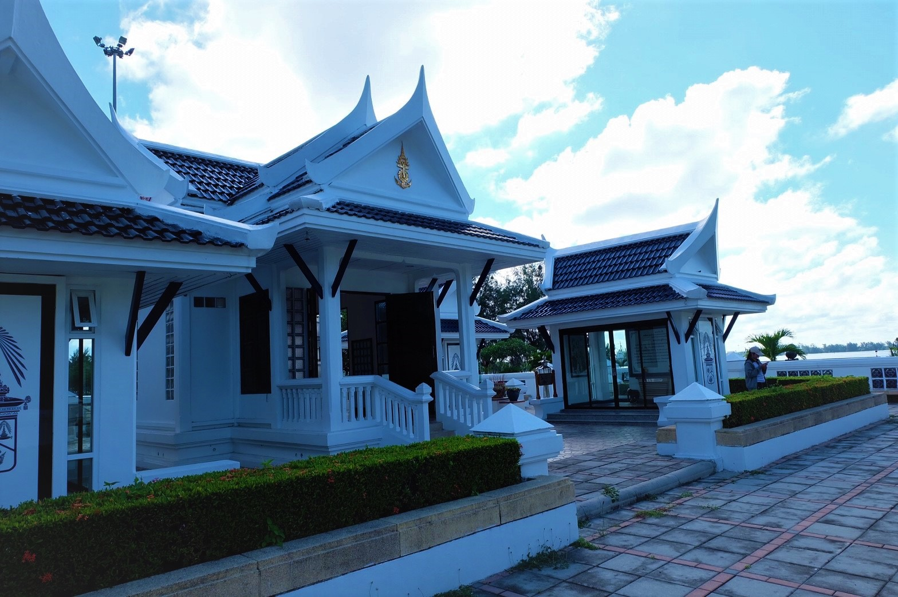
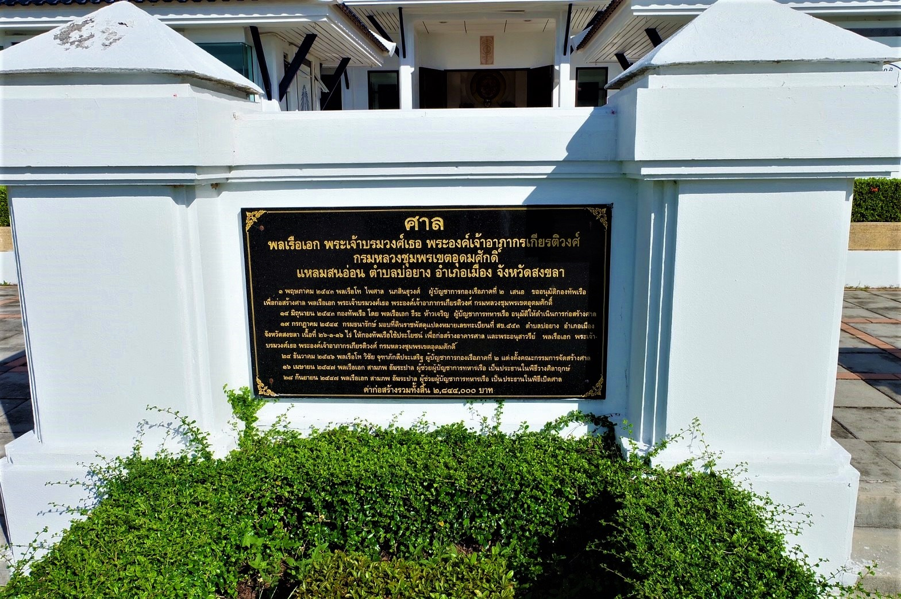
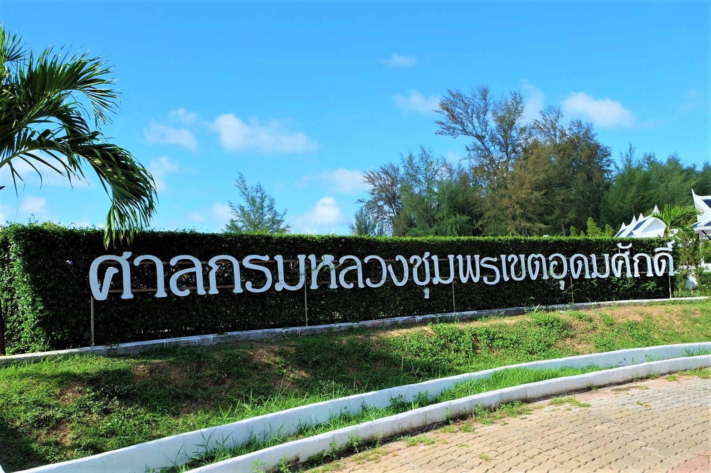
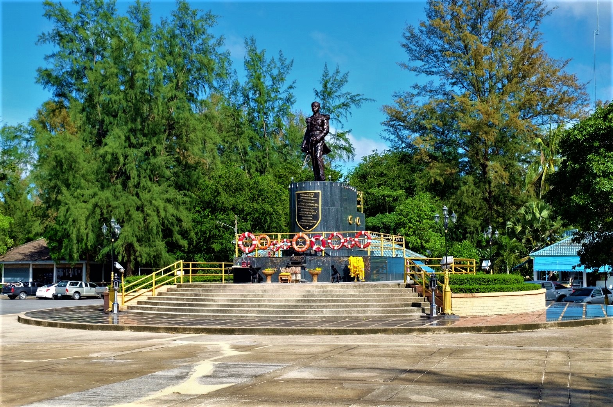
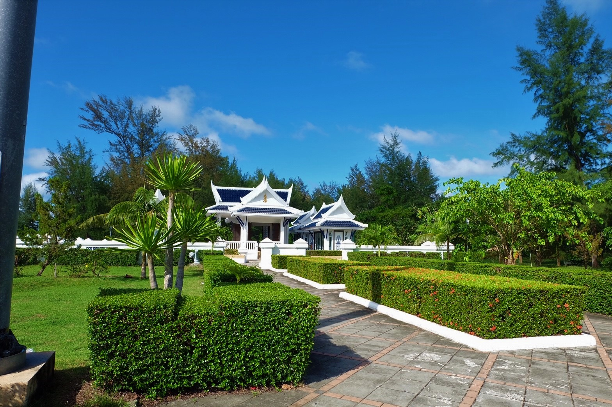
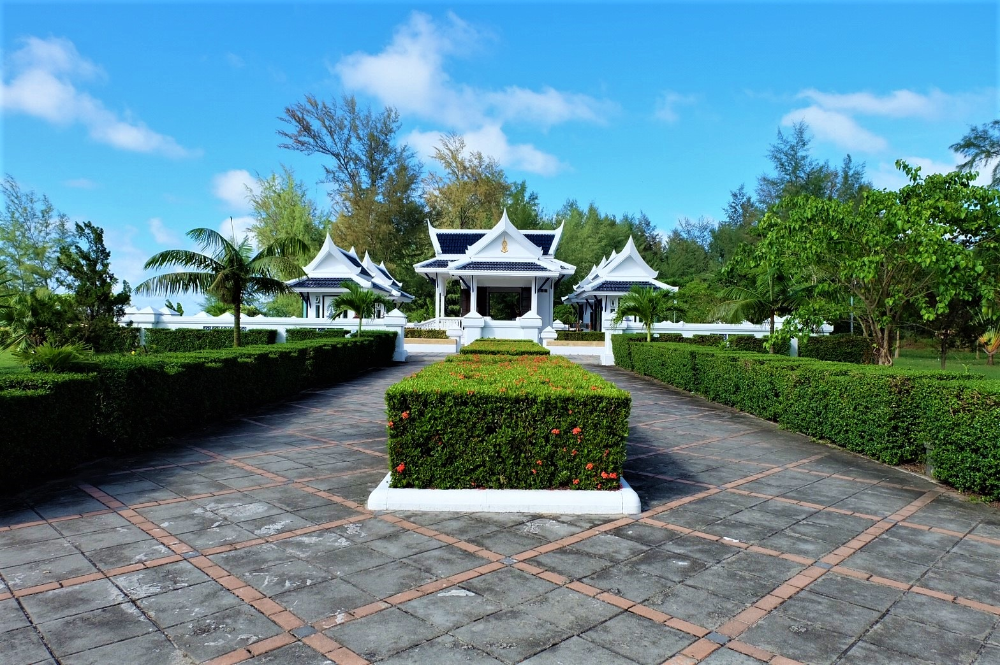
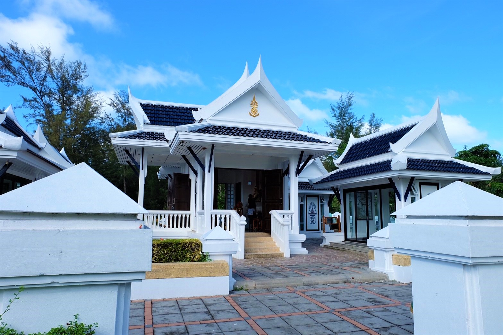
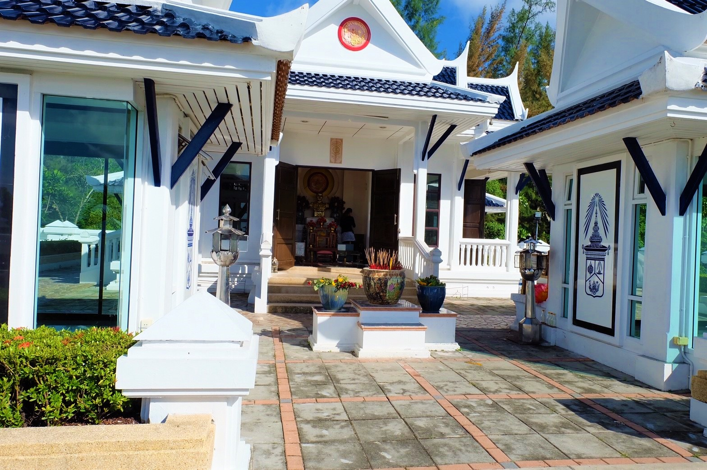

# cp<!DOCTYPE html>
<html>
<title>กรมหลวงชุมพร</title>
<meta charset="UTF-8">
<meta name="viewport" content="width=device-width, initial-scale=1">
<link rel="stylesheet" href="https://www.w3schools.com/w3css/4/w3.css">
<link rel="stylesheet" href="https://cdnjs.cloudflare.com/ajax/libs/font-awesome/4.7.0/css/font-awesome.min.css">

<body>

  <!-- Navbar (sit on top) -->

  

    <a href="index.html" class="w3-bar-item w3-button w3-hover-cyan"><i class="fa fa-bicycle"></i> <b>Songkhla</b>  Go Go</a>

    <!-- Float links to the right. Hide them on small screens -->
    

      <!--list of places -->
        

        <button class="w3-bar-item w3-button w3-hover-cyan w3-white">Travel Places <i class="fa fa-angle-down"></i></button>
        

          <a href="#" class="w3-bar-item w3-button w3-hover-cyan">วัดเขาเก้าแสน</a>
          <a href="#" class="w3-bar-item w3-button w3-hover-cyan">แหลมสมิหลา</a>
          <a href="#" class="w3-bar-item w3-button w3-hover-cyan">แหลมสนอ่อน หัวพญานาค</a>
          <a href="#" class="w3-bar-item w3-button w3-hover-cyan">กรมหลวงชุมพร</a>
          <a href="#" class="w3-bar-item w3-button w3-hover-cyan">เขาตังกวน</a>
          <a href="#" class="w3-bar-item w3-button w3-hover-cyan">ถนนนางงาม</a>
          <a href="#" class="w3-bar-item w3-button w3-hover-cyan">ถนนคนเดิน</a>
          <a href="#" class="w3-bar-item w3-button w3-hover-cyan">สวนป๋าเปรม</a>
          <a href="#" class="w3-bar-item w3-button w3-hover-cyan">วัดแหลมพ้อ</a>
  

      <a href="About.html" class="w3-bar-item w3-button w3-hover-cyan ">About Us</a>

    

  

<!-- Header -->
<header class="w3-display-container w3-content w3-wide" style="max-width:1600px;min-width:500px" id="home">
  
  

  

</header>

<!-- Page content -->

  <!-- About Section -->
  

    

     
     

   

    

      <!-- Menu Section -->
    <h1 class="w3-center w3-card-2 w3-cyan w3-cyan">ศาลกรมหลวงชุมพร</h1> 
      <h5 class="w3-center">ประวัติความเป็นมา</h5>
      
พลเรือเอก พระเจ้าบรมวงศ์เธอ พระองค์เจ้าอาภากรเกียรติวงศ์ กรมหลวงชุมพรเขตอุดมศักดิ์พระราชโอรสในพระบาทสมเด็จพระจุลจอมเกล้าเจ้าอยู่หัว และเจ้าจอมมารดาโหมด พระนามเดิมพระองค์เจ้าอาภากรเกียรติวงศ์ ประสูติ วันอาทิตย์ที่ 19 ธันวาคม พ.ศ. 2423 สิ้นพระชนม์ วันเสาร์ที่ 19 พฤษภาม พ.ศ. 2466 ทรงศึกษาสำเร็จวิชาทหารจากโรงเรียนทหารเรือ ประเทศอังกฤษ ทรงเข้ารับราชการในกระทรวงทหารเรือในรัชกาลที่ 5 ได้วางรากฐานปรับปรุงราชนาวีไทย ให้มีสมรรถภาพทัดเทียมอารยประเทศ ทรงดำรงตำแหน่งเสนาบดีกระทรวงทหารเรือในรัชกาลที่ 6 กองทัพเรือไทยรุ่งเรืองเป็นปึกแผ่นสืบมาจนถึงปัจจุบัน ด้วยพระอัจฉริยะปรีชาชาญ จึงน้อมถวายพระสมญานามว่า “องค์บิดาของทหารเรือไทย” กรมหลวงชุมพรเขตอุดมศักดิ์ หรือที่คุ้นเคยกันอีกชื่อหนึ่งว่า “เสด็จเตี่ย” ซึ่งเป็นที่เคารพนับถือของคนโดยทั่วไป โดยเฉพาะภาคใต้ที่มีอาชีพประมง เพราะเชื่อว่า ท่านจะช่วยเหลือให้แคล้วคลาดจากภัยอันตรายจากพายุ และเพศภัยต่างๆอนุสาวรีย์พลเรือเอก พระเจ้าบรมวงศ์เธอ พระองค์เจ้าอาภากรเกียรติวงศ์ กรมหลวงชุมพรเขตอุดมศักดิ์ ก่อตั้งโดยกลุ่มไทยอาสาป้องกันชาติในทะเล จังหวัดสงขลา ได้แก่ ผู้ประกอบอาชีพเกี่ยวกับการปกครอง ร่วมกับกองทัพเรือ สร้างเมื่อปี พ.ศ. 2530 เพื่อให้ชาวเรือ ได้สักการะบูชาก่อนออกไปประกอบอาชีพในทะเล
 
      <h5 class="w3-center">ความประทับใจ</h5>
      
กรมหลวงชุมพรหรือเสด็จเตี่ย เป็นที่เคารพรักของชาวสงขลา เห็นได้จากการสร้างรูปปั้นขนาดใหญ่เพื่อสักการบูชา บริเวณโดยรอบมีความร่มรื่น มีเก้าอี้ไว้นั่งหันหน้าออกไปทางทะเล หากไปในช่วงเวลายามเย็นจะเห็นพระอาทิตย์ตกดินเป็นแสงสวยงาม มองเห็นทะเลสุดลูกหูลูกตา เรือประมงแล่นผ่านไปมาทำให้ได้รับรู้ถึงวิถีชีวิตของชาวสงขลา เมื่อเดินไปไม่ไกลก็จะเจอกับศาลกรมหลวงชุมพร ซึ่งมีผู้คนมาไหว้สักการะ และเสี่ยงเซียมซี เมื่อผลที่ออกมาไม่สู้ดีนักก็จะทำบุญเพื่อให้เกิดความสบายใจ 

    

  

  

  <!-- Menu Section -->
  

    

      <h1 class="w3-center w3-card-2 w3-cyan ">ข้อมูลสถานที่</h1> 
      <h4>ที่ตั้ง</h4>
      
แหลมสนอ่อน ตำบล บ่อยาง อำเภอเมืองสงขลา สงขลา 90000
 

      <h4>วันและเวลาทำการ</h4>
      
เปิดทำการทุกวัน ตลอดเวลา 24 ชั่วโมง
 

      <h4>ค่าเข้าชม</h4>
      
ไม่มีค่าใช้จ่ายในการเข้าชม
 

      <h4>การเดินทาง</h4>
      
ศาลกรมหลวงชุมพรเขตอุดมศักดิ์ ตั้งอยู่ถัดจากสวนสองทะเลส่วนหัวพญานาคพ่นน้ำประมาณ 300 เมตร
 

    

    

      
       
      
    

    <h3 style="text-align:center;">แผนที่</h3>
    
<iframe src="https://www.google.com/maps/embed?pb=!1m18!1m12!1m3!1d3958.1115107007618!2d100.57605121431986!3d7.228120294782044!2m3!1f0!2f0!3f0!3m2!1i1024!2i768!4f13.1!3m3!1m2!1s0x0%3A0x28f39dbdfd2e0c08!2z4Lio4Liy4Lil4LiB4Lij4Lih4Lir4Lil4Lin4LiH4LiK4Li44Lih4Lie4Lij4LmA4LiC4LiV4Lit4Li44LiU4Lih4Lio4Lix4LiB4LiU4Li04LmM!5e0!3m2!1sth!2sth!4v1493724932139" width="600" height="400" frameborder="0" style="border:0" allowfullscreen></iframe>

  

<h1 class="w3-center w3-card-2 w3-cyan">ภาพบรรยากาศ</h1> 
 
 
 
 
 
 
 

<!-- End page content -->

</body>
</html>
